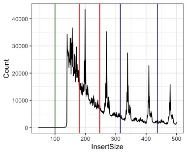
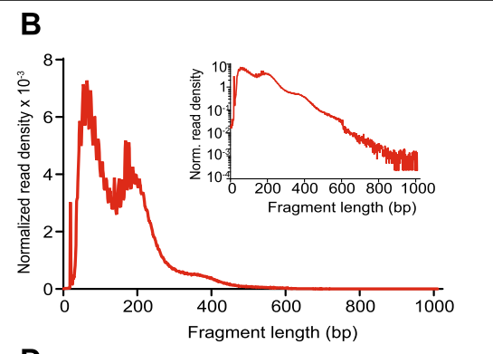

# Results / notes and thoughts

See [this](https://github.com/MooHoll/Asian_Psyllid_Methylation/blob/master/Identification_Sex_Chromosomes/identification_sex_chromosomes.md) as an example.

---

Data needed adapter trimming as well as quality trimming. This left a lot of unpaired reads but these could still be aligned using Bowtie.

Alignment rates were great! Around 80-90%.

---

## Post-alignment quality checking
Not happy with the insert size distribution, only checked sample 0_1. I will re-run trimming on the raw data and only remove adapters this time rather than trimming so harshly to see if this helps. 

This is how 0_1 looks. 

This is how it should look, taken from [here](https://genomebiology.biomedcentral.com/articles/10.1186/s13059-020-1929-3). 

